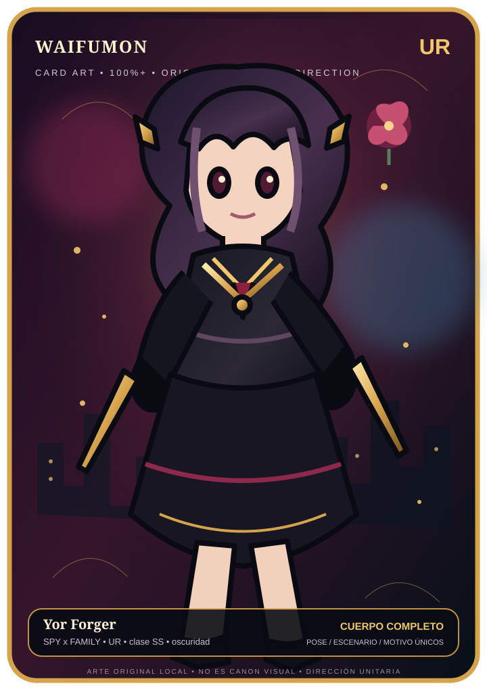
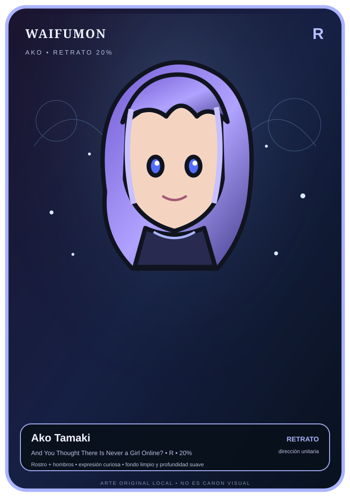
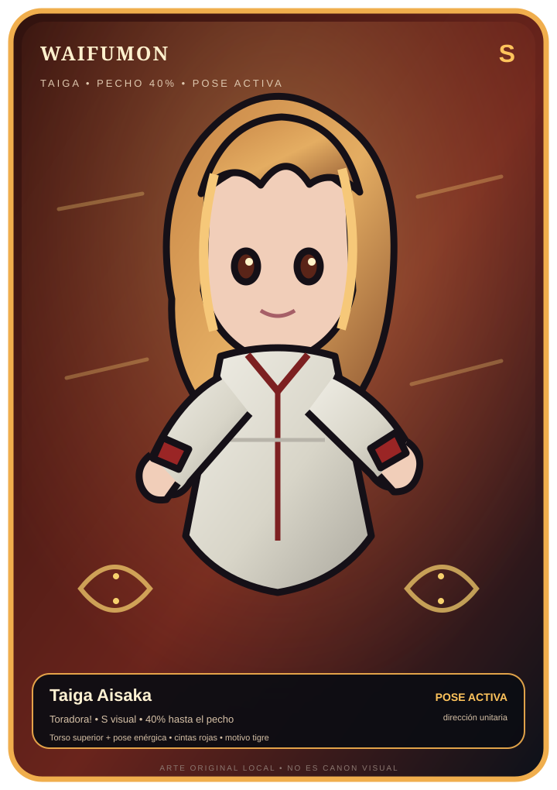
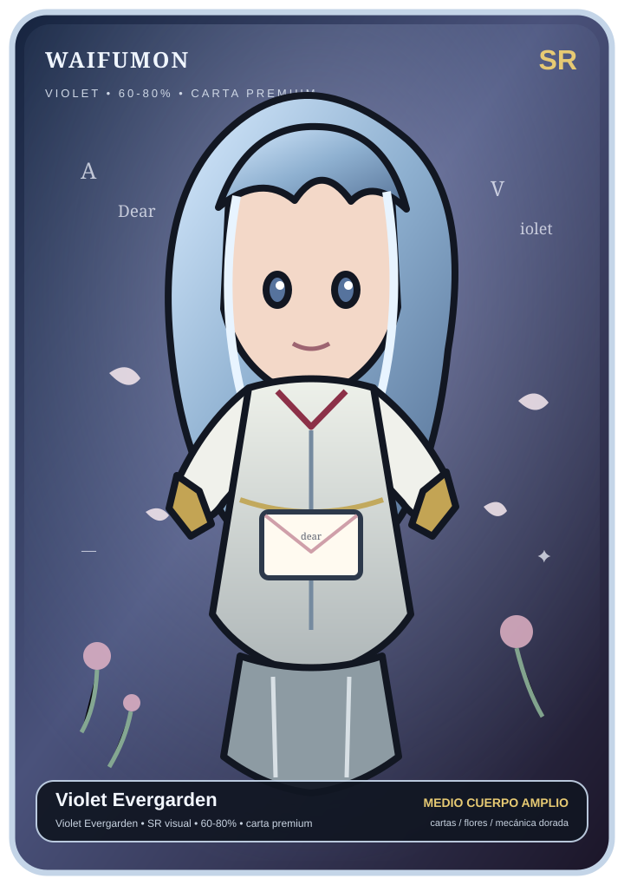

# Biblioteca artística WaifuMon

Producción unitaria. Cada pieza se aprueba por separado y queda versionada en `assets/waifus/`.

## Galería actual

### Yor Forger — UR

**Encuadre:** 100%+ · cuerpo completo  
**Dirección:** asesina elegante, rojo/vino/dorado, escena nocturna, rosa y estilismo propio.

### Ako Tamaki — R

**Encuadre:** 20% · rostro + hombros  
**Dirección:** retrato limpio, paleta lavanda, expresión curiosa, profundidad suave.

### Taiga Aisaka — S

**Encuadre:** 40% · torso superior  
**Dirección:** energía activa, uniforme, cintas rojas y motivo de tigre.

### Violet Evergarden — SR

**Encuadre:** 60-80% · medio cuerpo amplio  
**Dirección:** cartas, flores, azul petróleo y luz de atardecer.

## Regla de composición

- **R:** rostro + hombros (~20%).
- **S:** torso superior hasta pecho (~40%).
- **SR:** medio cuerpo amplio (60-80%).
- **UR:** cuerpo completo y composición abierta (100%+).

El objetivo de estilo es una ilustración anime de fantasía/aventura original, expresiva y pulida. Las referencias externas solo definen nivel de acabado y energía; no se copia literalmente la firma visual de una obra o artista.

## Estado

Cartas con arte unitario aprobado: **4 / 78 (5.13%)**.

Dirección artística individual declarada: **23 / 78 (29.49%)**.

Pendientes: **74 / 78** piezas de arte final.

[Volver al repositorio](https://github.com/eltiootaku01-hue/bot-telegram)
